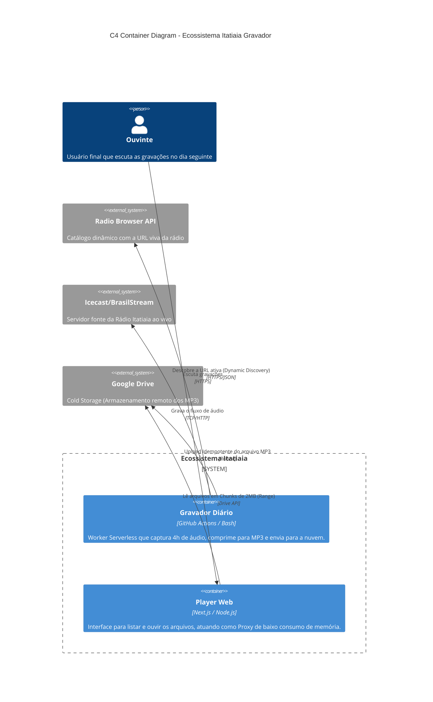

# Gravador Automático — Rádio Itatiaia

Grava automaticamente 4 horas da Rádio Itatiaia (00h–04h BRT) todo dia e salva no Google Drive.

---

## Como configurar (passo a passo)

### 1. Criar o repositório no GitHub

1. Acesse [github.com/new](https://github.com/new)
2. Crie um repositório **privado** com o nome `itatiaia-gravador`
3. Clone no seu Mac:
   ```bash
   git clone https://github.com/SEU_USUARIO/itatiaia-gravador
   cd itatiaia-gravador
   ```

### 2. Copiar os arquivos

Copie o arquivo `.github/workflows/gravar.yml` para dentro do repositório clonado, mantendo a estrutura de pastas.

### 3. Configurar o Google Drive (uma única vez)

**Importante:** os arquivos de áudio na pasta **Itatiaia** do Google Drive devem estar compartilhados como **"Qualquer pessoa com o link"** (Viewer). Sem isso, o player não conseguirá acessar os arquivos diretamente.

No Terminal do seu Mac:

```bash
chmod +x setup_gdrive.sh
./setup_gdrive.sh
```

Isso vai abrir o navegador para você autorizar o acesso ao Google Drive. Depois, rode:

```bash
cat ~/.config/rclone/rclone.conf
```

Você vai ver algo assim:
```
[gdrive]
type = drive
client_id = 123456.apps.googleusercontent.com
client_secret = GOCSPX-xxxxx
token = {"access_token":"...","refresh_token":"...","expiry":"..."}
```

### 4. Adicionar os Secrets no GitHub

Vá em: **GitHub → seu repositório → Settings → Secrets and variables → Actions**

Adicione 3 secrets:

| Nome | Valor |
|------|-------|
| `GDRIVE_CLIENT_ID` | o valor de `client_id` |
| `GDRIVE_CLIENT_SECRET` | o valor de `client_secret` |
| `GDRIVE_TOKEN` | o JSON inteiro do `token` (com as chaves `{}`) |

### 5. Fazer o push

```bash
git add .
git commit -m "setup gravador itatiaia"
git push
```

### 6. Testar manualmente

No GitHub, vá em **Actions → Gravar Rádio Itatiaia → Run workflow**.

Isso vai disparar uma gravação imediata (mas vai gravar 4h, então aguarde ou cancele depois de alguns minutos só para testar o upload).

---

## Resultado

Todo dia, ao acordar, você terá um arquivo `itatiaia_YYYY-MM-DD.mp3` na pasta **Itatiaia** do seu Google Drive, pronto para ouvir.

A gravação é normalizada para **44,1 kHz, mono** e depois comprimida como **MP3 a 48 kbit/s**. Uma gravação de 4 horas ocupa aproximadamente **86 MB**. A normalização também evita erros de reprodução quando a rádio muda o sample rate do stream entre 48 kHz e 44,1 kHz.

O arquivo WAV intermediário existe somente durante o workflow e é removido antes do upload. O upload envia apenas um arquivo por vez e usa buffers pequenos para limitar o uso de memória.

---

## Observações

- O repositório deve ser **privado** para proteger os seus tokens
- O token do Google Drive tem refresh automático — não precisa renovar
- Se quiser gravar só alguns dias da semana, edite o cron em `gravar.yml`:
  - Seg a Sex: `0 3 * * 1-5`
  - Só fim de semana: `0 3 * * 6,0`

## Resiliência a falhas de rede

O pipeline trata a conexão com a rádio e o Google Drive como sujeita a **partições de rede**. Na prática, seguindo o raciocínio do teorema CAP, ele prioriza disponibilidade durante falhas transitórias e recupera a consistência por convergência:

- **Failover em Movimento (Mid-Race Insurance):** Se um servidor cair definitivamente no meio da madrugada, o script inspeciona os segundos gravados (`ffprobe`), pula dinamicamente para uma URL reserva (Dynamic Discovery), capta o tempo restante e "solda" os áudios de forma imperceptível no final.
- FFmpeg reconecta em EOF, erros TCP/TLS e respostas HTTP `408`, `429` e `5xx`, usando backoff exponencial limitado a 60 segundos.
- Instalação de pacotes e rclone possui tentativas adicionais com espera progressiva.
- O upload usa os retries internos do rclone e até 6 tentativas externas com backoff de 10 a 120 segundos.
- `copyto` grava sempre no mesmo caminho diário e `--checksum` evita duplicação ou reenvio desnecessário após uma resposta perdida. Assim, repetir o job é idempotente quanto ao nome do arquivo no Drive.

Falhas permanentes continuam encerrando o job com erro em vez de produzir ou publicar silenciosamente um arquivo incompleto.

## Fontes & Tecnologias (Sources)

O projeto foi construído e estabilizado graças a várias ferramentas open-source e APIs públicas:

- **[Radio Browser API](https://www.radio-browser.info/):** Utilizado para Descoberta Dinâmica de Serviços (Dynamic Service Discovery). Garante que a URL da rádio seja sempre a mais atual, atuando como o fallback principal caso o link estático caia ou mude de IP.
- **[FFmpeg](https://ffmpeg.org/):** Motor de áudio responsável por conectar no *Icecast*, baixar o stream, re-escanear *sample rates* no meio da transmissão, garantir a normalização do espectro e realizar a compressão pesada para MP3.
- **[Rclone](https://rclone.org/):** Usado para a comunicação resiliente e idempotente de CLI com a API do Google Drive sem a necessidade de SDKs complexos.
- **[Next.js API Routes](https://nextjs.org/):** O backend de roteamento e *proxy* do player lida com as requisições de áudio por *Range Headers*, garantindo a segmentação do buffer para evitar os limites de RAM da plataforma de hospedagem.

## Arquitetura (C4 Model)

O diagrama abaixo ilustra como o sistema está distribuído entre captura (Worker) e distribuição (Web Player):



## Decisões de Engenharia

Para entender os desafios enfrentados (Limites de Memória no Render, Bloqueios de IP, Mudanças de Sample Rate, Espaço em Disco) e como os resolvemos com padrões de software, leia a página dedicada:

👉 **[Registro de Decisões Técnicas (ADR)](docs/DECISOES_TECNICAS.md)**
